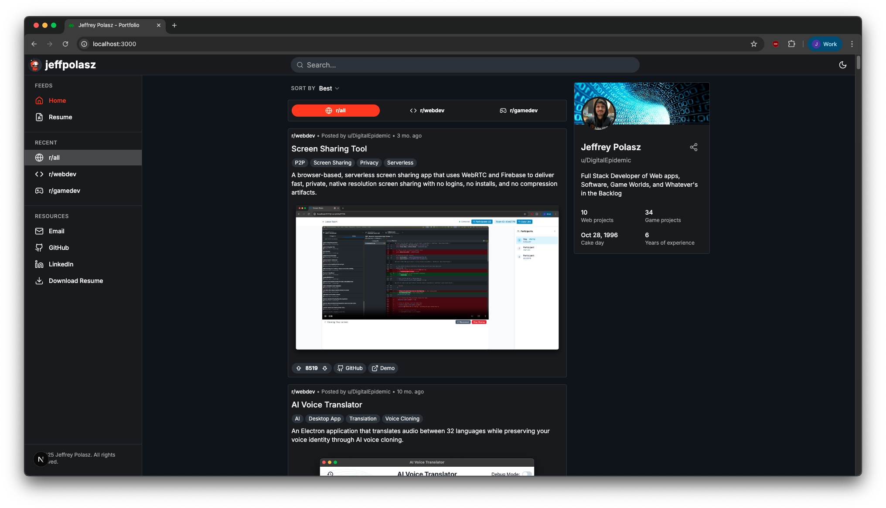
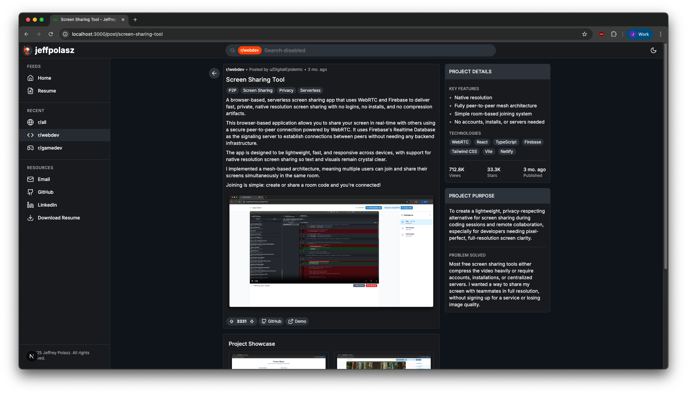

# Jeffrey Polasz - Portfolio

A modern, responsive portfolio website showcasing game development and web development projects with a Reddit-inspired design.

## 🚀 Live Site

**Production:** [https://jeffpolasz.com](https://jeffpolasz.com)

## 📸 Screenshots

|                     Main Portfolio View                     |                     Project Detail Page                     |
| :---------------------------------------------------------: | :---------------------------------------------------------: |
|  |  |
|       Reddit-inspired layout with sidebar navigation        |          Detailed project showcase with tech stack          |

## ✨ Features

- **Reddit-inspired UI** with desktop sidebar and mobile sheet navigation
- **Advanced search & filtering** by project type, technology, and tags
- **Responsive design** optimized for all device sizes
- **Dark/Light theme** with smooth transitions
- **Interactive project galleries** with lightbox functionality
- **Animated components** using Framer Motion
- **SEO optimized** with structured data and OpenGraph support
- **Comprehensive test coverage** (95%+)

## 🛠️ Tech Stack

- **Framework:** Next.js 15 with App Router
- **Language:** TypeScript
- **Styling:** Tailwind CSS
- **UI Components:** shadcn/ui
- **Animations:** Framer Motion
- **Testing:** Jest + React Testing Library
- **Build:** npm

## 🏗️ Project Structure

```
├── app/                  # Next.js app directory (pages & layouts)
│   └── __tests__/        # App-level tests
├── components/           # Reusable React components
│   ├── ui/               # shadcn/ui components
│   └── __tests__/        # Component tests
├── data/                 # Portfolio data and constants
├── hooks/                # Custom React hooks
├── lib/                  # Utility functions and helpers
├── public/               # Static assets and images
├── scripts/              # Build and deployment scripts
└── types/                # TypeScript type definitions
```

## 🚀 Getting Started

```bash
# Install dependencies
npm install

# Start development server
npm run dev

# Run tests
npm test

# Build for production
npm run build
```

## 📱 Key Components

- **Navigation System**: Responsive sidebar and mobile navigation
- **Project Showcase**: Interactive cards with voting and sharing
- **Search & Filter**: Real-time project filtering with debounced search
- **Theme System**: Dark/light mode with system preference detection
- **Resume Integration**: Built-in resume viewer with PDF download
